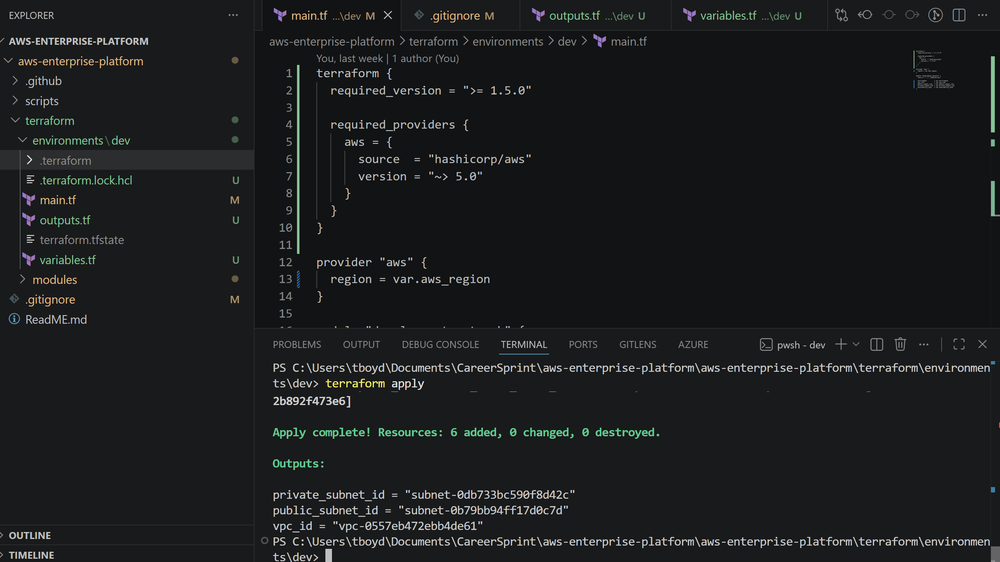
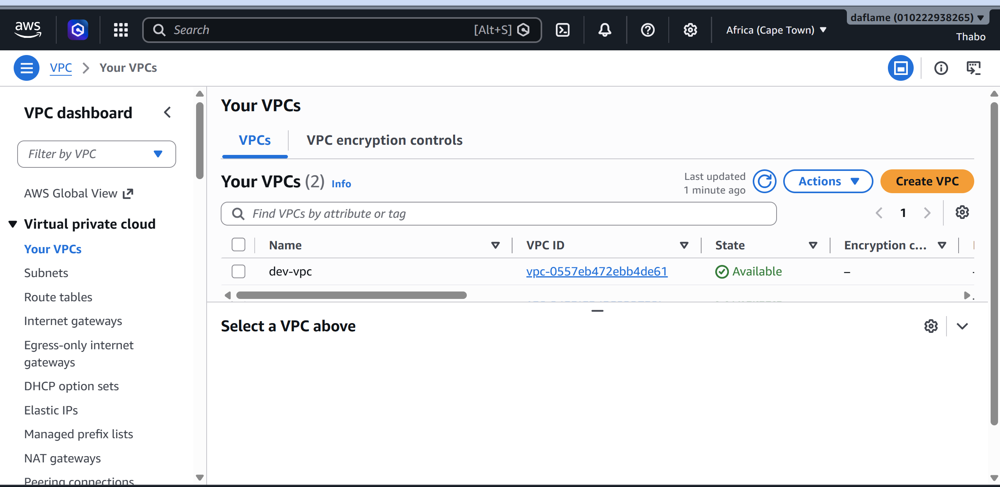
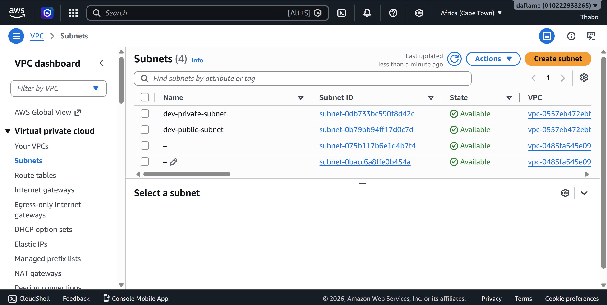
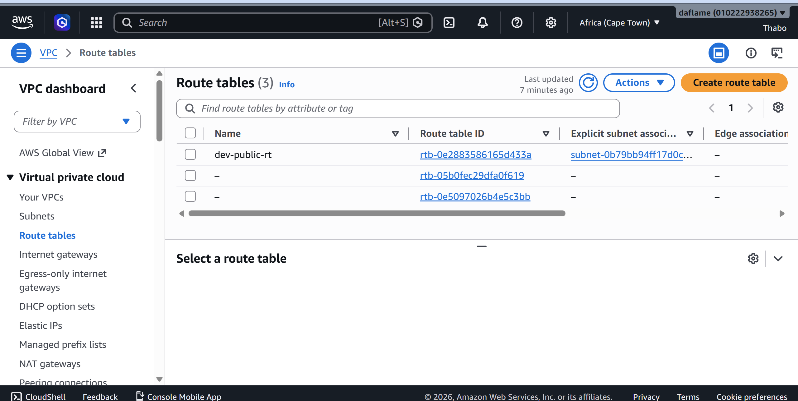

# AWS VPC Infrastructure with Terraform

A simple, well-structured AWS networking foundation built with Terraform, featuring automated validation via GitHub Actions and a Python verification script.

I built this as a hands-on project to practice Infrastructure as Code (IaC) fundamentals: modular Terraform design, remote CI/CD validation, and secure AWS credential handling.

## What this project does

This project deploys a basic but properly structured VPC in AWS using Terraform. It includes:

- A custom VPC with public and private subnets
- An Internet Gateway attached to the VPC
- A route table so the public subnet can reach the internet
- A GitHub Actions pipeline that automatically checks the Terraform code on every push
- A small Python script that uses boto3 to double check the deployment actually exists in AWS

I kept the scope intentionally small. The goal was to get the fundamentals right (module structure, state handling, CI validation, tagging) rather than build something huge.

## Architecture


The setup is a single VPC (`10.0.0.0/16`) split into:

- **Public subnet** (`10.0.1.0/24`) - has a route to the internet through the Internet Gateway, used for anything that needs to be reachable
- **Private subnet** (`10.0.2.0/24`) - no route to the internet, used for anything that should stay internal

Note: I did not add a NAT Gateway. This is intentional, not an oversight. A NAT Gateway costs money to run (roughly $30+/month plus data transfer), and since this is a personal learning project, I decided it wasn't worth it. In a real production setup, you'd add a NAT Gateway so resources in the private subnet could still reach the internet for things like software updates, while staying unreachable from the outside.

## Tech stack

- **Terraform** (~> 5.0 AWS provider) - infrastructure as code
- **AWS** (af-south-1 / Cape Town region) - cloud provider
- **Python + boto3** - post-deployment verification script
- **GitHub Actions** - CI pipeline for formatting, validation, and plan checks

## Project structure

```
aws-vpc-terraform/
├── .github/
│   └── workflows/
│       └── iac-pipeline.yml       # CI pipeline (fmt, init, validate, plan)
├── docs/
│   └── screenshots/                # Proof of deployment
├── scripts/
│   └── verify_deployment.py        # Confirms the VPC/subnets exist in AWS
├── terraform/
│   ├── environments/
│   │   └── dev/                    # Dev environment config (calls the vpc module)
│   └── modules/
│       └── vpc/                    # Reusable VPC module
├── requirements.txt
└── README.md
```

I split the code into a `modules/vpc` folder and an `environments/dev` folder on purpose. The module contains the actual resources, and the environment folder just calls the module with specific values. This means if I wanted a `staging` or `prod` environment later, I could reuse the same module without rewriting anything.

## Prerequisites

If you want to run this yourself, you'll need:

- An AWS account
- Terraform installed (v1.5 or later)
- AWS CLI installed and configured (`aws configure`) with an IAM user (not root)
- Python 3.10+ if you want to run the verification script

### Setting up AWS credentials

1. In the AWS Console, go to **IAM > Users** and create a new user (don't use your root account for this)
2. Give it programmatic access and attach a suitable policy (I used a broad policy for simplicity while learning, but in a real environment you'd scope this down to only what's needed, e.g. VPC permissions)
3. Generate an **Access Key ID** and **Secret Access Key** under the user's Security Credentials tab
4. Run `aws configure` locally and paste in those values

If you're setting up the GitHub Actions pipeline, you'll also need to add these as repository secrets:

- Go to your repo's **Settings > Secrets and variables > Actions**
- Add `AWS_ACCESS_KEY_ID` and `AWS_SECRET_ACCESS_KEY`

Never commit these values directly into your code.

## How to deploy

1. Clone the repo

```bash
git clone https://github.com/thabomoagi/aws-vpc-terraform.git
cd aws-vpc-terraform/terraform/environments/dev
```

2. Initialize Terraform

```bash
terraform init
```

3. Check what will be created

```bash
terraform plan
```

4. Deploy it

```bash
terraform apply
```

Type `yes` when prompted. This creates 6 resources: the VPC, the internet gateway, both subnets, the route table, and the route table association. All of these are free tier resources, there's no NAT Gateway or anything else that costs money.

## Verifying the deployment

After applying, you can check the outputs Terraform gives you:

```bash
terraform output
```

You can also run the Python script to double check everything was actually created in AWS (not just in Terraform's state file):

```bash
python -m venv venv
venv\Scripts\activate      # or source venv/bin/activate on Mac/Linux
pip install -r requirements.txt
python scripts/verify_deployment.py
```

This script uses boto3 to query AWS directly for the VPC and its subnets, and prints out what it finds. I wrote this mainly to prove to myself that Terraform's state actually matched reality, and it turned out to be a decent way to practice using boto3.

## CI/CD pipeline

Every push to `main` (or pull request into it) triggers a GitHub Actions workflow that:

1. Checks the Terraform code is formatted correctly (`terraform fmt -check`)
2. Initializes Terraform
3. Validates the syntax (`terraform validate`)
4. Runs a plan so you can see what would change

The pipeline does **not** automatically apply changes to AWS. I kept this manual on purpose, since I didn't want infrastructure to be created or destroyed just from pushing code while I'm still learning. In a team setting with proper environments and approvals, auto-apply would make more sense.

## Screenshots

Terraform apply completing successfully:



The VPC in the AWS Console:



The subnets in the AWS Console:



The route table:



## Cleaning up

To avoid any AWS charges, you can tear everything down with:

```bash
terraform destroy
```

## What I learned building this

- How Terraform modules work and why splitting reusable code from environment specific config is useful
- Why the `.terraform.lock.hcl` file should be committed to git but `.terraform/` and state files should not
- How to set up a basic CI pipeline that validates infrastructure code before it gets merged
- How to store AWS credentials securely using GitHub Secrets instead of hardcoding them
- The tradeoff between convenience and cost when deciding whether to add a NAT Gateway
- How to use boto3 to verify infrastructure exists, separate from just trusting Terraform's state

## Possible future improvements

These are things I'd add if I kept building this out, listed here so it's clear they're deliberate next steps and not things I forgot:

- Move Terraform state to an S3 backend with DynamoDB locking, instead of keeping it local
- Add a NAT Gateway for the private subnet (with a cost tradeoff callout)
- Add a `staging` and `prod` environment using the same VPC module
- Scope the IAM user down to least privilege instead of a broad policy
- Extend the GitHub Actions pipeline to require manual approval before apply
